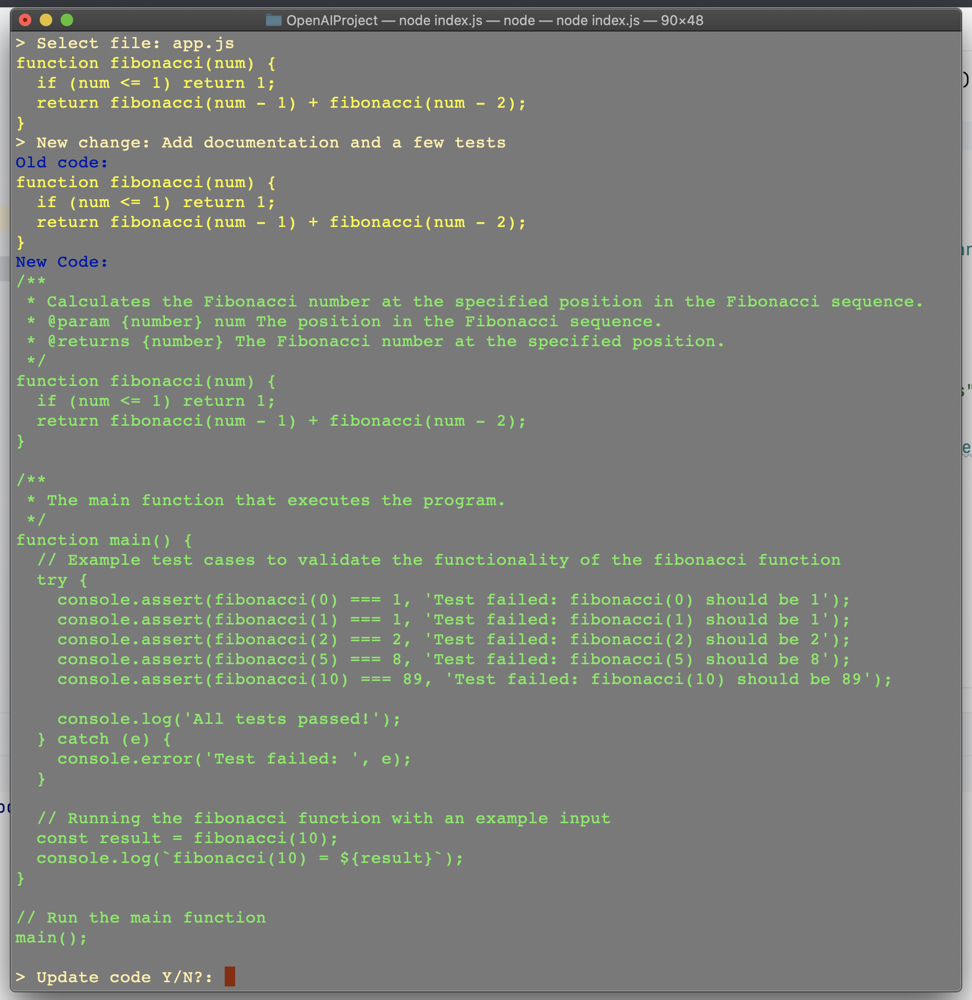

# Chat Code 💻

This CLI application is created to make coding tasks easier and more interactive. It's a straightforward tool that helps in two major ways:


1. **Chatting with Code Feature**: Chat with your code. You can simply tell the assistant what changes you want in your code, and it will apply these changes for you. It's like having a conversation with your codebase, making coding more accessible and maybe even a bit more fun.
2. **Syncing Local Project Files**: The application can synchronize your local project files with the assistant. This means your working files are always up-to-date and aligned with what the assistant understands and works with.

The goal of this application is to provide a user-friendly way to manage and modify your code without getting too deep into technicalities. It's about simplifying your coding workflow by just chatting with your code.

## Overview


## Commands

The application supports the following main commands:

1. **Check**: Verifies if the assistant exists.
2. **Create**: Creates the assistant if it does not exist.
3. **Sync**: Creates the assistant if it does not exist and performs synchronization if required.
4. **CC (Chat with Code)**: Engages in a coding-related conversation with the assistant.

### Using Chat with Code (CC)

With the `CC` (Chat with Code) feature, you can now modify your entire code base using a chat interface. This innovative approach simplifies code alterations and enhances productivity. Here's how it works:

- When you select `CC`, the application allows you to select a file for code analysis and modification. For example:
    - You select `app.js`.
    - The assistant then reads and displays the code.
    - You can request changes to the code, like finding odd Fibonacci numbers less than 100.
    - The assistant modifies the code accordingly and displays the new version for review.

## Getting Started

### Prerequisites
- Node.js installed on your machine.
- An active OpenAI API key.

### Installation
Install the required dependencies:
```bash
npm install
```

### Configuration
Create a `.env` file in the root directory of the project with the following content:
```env
OPENAI_API_KEY=[Your OpenAI API Key]
APP_PATH="./app" # Your app to sync
ASSISTANT_NAME=ChatCodeAssistant
```

Replace `[Your OpenAI API Key]` with your actual OpenAI API key. We use [openai assistants](https://platform.openai.com/docs/assistants/how-it-works).

### Example


```
> node index.js
· · 1. Check) Check if the assistant exists
· · 2. Create) Create the assistant if it does not exist
· · 3. Sync) Create the assistant if it does not exist and sync if required
· · 4. CC) Chat with code
```
Selecting the 'Chat with Code' Option(CC)
```
>: CC
```

The application prompts you to select a file from a list:
```
app.js
app.py
app.txt
> Select file: app.js
```
Content of the app.js is showed.
```
console.log("Hello worldd")

function fibonacci(num) {
    var a = 1, b = 0, temp;

    while (num >= 0) {
        temp = a;
        a = a + b;
        b = temp;
        num--;
    }

    return b;
}

console.log(fibonacci(7));
```

You can request specific changes to the code. Example request:

```
> New change: find an odd fibonaci numbers < 100
Waiting for state change, current state(in_progress)...
Waiting for state change, current state(in_progress)...
Run status: completed

console.log("Hello worldd")

function oddFibonacciNumbersLessThan100() {
  let a = 1, b = 1, temp;
  const result = [];
  
  while (b < 100) {
    if (b % 2 !== 0) {
      result.push(b);
    }
    temp = a;
    a = a + b;
    b = temp;
  }
  
  return result;
}

console.log(oddFibonacciNumbersLessThan100());

function fibonacci(num) {
    var a = 1, b = 0, temp;

    while (num >= 0) {
        temp = a;
        a = a + b;
        b = temp;
        num--;
    }

    return b;
}

Received a code. Evaluate

```
Show the diff between old code and new one.
```
Old code:
console.log("Hello worldd")

function fibonacci(num) {
var a = 1, b = 0, temp;

    while (num >= 0) {
        temp = a;
        a = a + b;
        b = temp;
        num--;
    }

    return b;
}

console.log(fibonacci(7));

New Code:
console.log("Hello worldd")

function oddFibonacciNumbersLessThan100() {
let a = 1, b = 1, temp;
const result = [];

while (b < 100) {
if (b % 2 !== 0) {
result.push(b);
}
temp = a;
a = a + b;
b = temp;
}

return result;
}

console.log(oddFibonacciNumbersLessThan100());

function fibonacci(num) {
var a = 1, b = 0, temp;

    while (num >= 0) {
        temp = a;
        a = a + b;
        b = temp;
        num--;
    }

    return b;
}
```
The application then displays the modified code for review. Once reviewed, you're prompted to confirm the update:
```
> Update code Y/N?: Y
Code updated
· · 1. Check) Check if the assistant exists
· · 2. Create) Create the assistant if it does not exist
· · 3. Sync) Create the assistant if it does not exist and sync if required
· · 4. CC) Chat with code
```

## Current Support and Evaluation Process

### JavaScript Support
Right now, our CLI application only works with JavaScript (.js) files.
### How We Use Puppeteer for Code Evaluation
We use a tool called Puppeteer to check if the changes you make to your code are working fine. Here's what happens:

- **Automatic Checking**: Every time you change your code using the chat feature, Puppeteer runs it to see if it works.

- **Finding and Reporting Errors**: If there's a problem, Puppeteer lets us know what went wrong.

- **Fixing Errors with ChatGPT's Help**: You can then ask ChatGPT about the error. It'll give you advice on how to fix it.

- **Keep Trying Until It Works**: You can use ChatGPT's suggestions to fix your code. We'll keep checking it with Puppeteer until there are no more errors.

This process is straightforward. It helps you fix your JS code and learn more about coding along the way.

## License
MIT

This project is not affiliated with OpenAI but is designed to work with OpenAI's APIs.
